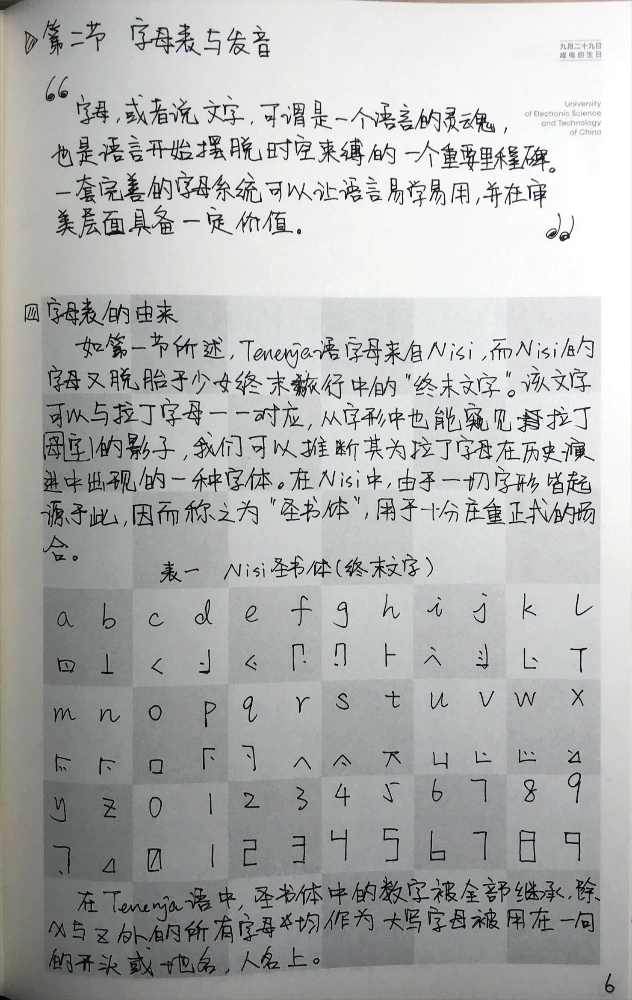
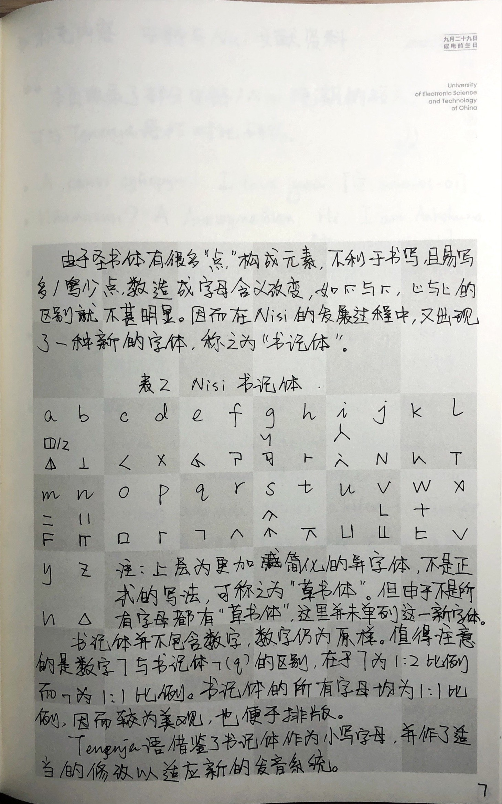
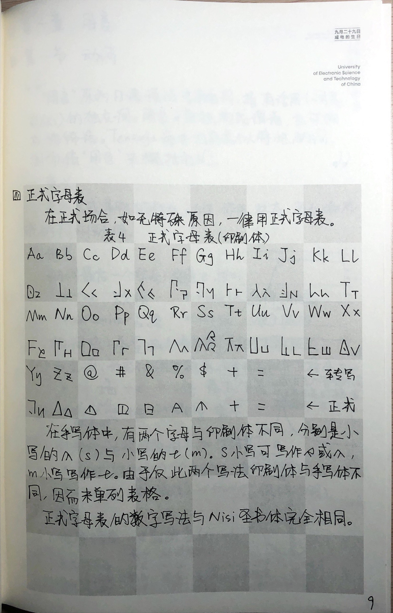

# 拉丁转写字母表
## 单字母

> 还有一个字母`=`代表软音符号`ь`，现已不再使用。

|  **字母**  |  a  |  b  |  c  |  d  |  e  |  f  |  g  |  h  |
| --- | --- | --- | --- | --- | --- | --- | --- | --- |
|  **词中**  | /a/ | /b/ 或 /p/ | /tɕʰ/ | /d/ 或 /t/ | /e/ | /f/ | /g/ 或 /k/ | /x/ |
|  **自身**  | /a/ | /be/ 或 /pe/ | /tɕʰi/ | /de/ 或 /te/ | /e/ | /ef/ | /ge/ 或 /ke/ | /xa/ |
|  **转写**  |  a  |  b  |  c  |  d  |  e  |  f  |  g  |  h  |

|  **字母**  |  i  |  j  |  k  |  l  |  m  |  n  |  o  |  p  |
| ---| --- | --- | --- | --- | --- | --- | --- | --- |
|  **词中**  | /ɨ/ | /i/ 或 /j/ | /k/ 或 /kʰ/ | /l/ | /m/ | /n/ | /o/ | /p/ 或 /pʰ/ |
|  **自身**  | /ɨ/ | /i/ | /kʰe/ | /el/ | /em/ | /en/ | /o/ | /pʰi/ |
|  **转写**  |  eu  |  i  |  k  |  l  |  m  |  n  |  o  |  p  |

|  **字母**  |  q  |  r  |  s  |  t  |  u  |  v  |  w  |  x  |
| ---| --- | --- | --- | --- | --- | --- | --- | --- |
|  **词中**  | /q/ | /r/ 或 /ɾ/ | /s/| /t/ | /u/ | /v/ | /w/ | /ɕ/ |
|  **自身**  | /qɑ/ | /er/ 或 /ɝ/ | /es/ | /te/ | /u/ | /vi/ | /sovi/ | /ɕi/ |
|  **转写**  |  q  |  rr  |  s  |  t  |  u  |  v  |  w  |  x  |

|  **字母**  |  y  |  z  |  #  |  $  |  %  |  &  |  @  |  +  |
| ---| --- | --- | --- | --- | --- | --- | --- | --- |
|  **词中**  | /y/ | /z/ | /ɔ/ | /ʂ/ | /ʐ/ | /ø/ | /ɤ/ | /tɕ/ |
|  **自身**  | /y/ | /ze/ | /ɔ/ | /ʂe/ | /ʐe/ | /ø/ | /ɤ/ | /tɕi/ |
|  **转写**  |  y  |  z  |  oo  |  sh  |  r  |  ye  |  eo  |  j  |

## 双字母

|  **字母**  |  nj  |  ng  |  gh  |  ts  |  dz  |  ch  |  zh  |
| ---| --- | --- | --- | --- | --- | --- | --- |
|  **词中**  | /ɲ/ | /ŋ/ | /ɣɑ/ | /tsʰ/ | /dz/ 或 /ts/ | /tʂʰ/ | /dʐ/ 或 /tʂ/ | /ɣ/ | /ɲ/ |
|  **自身**  | /ɲa/ | /ŋa/ | /ɣɑ/ | /tsʰe/ | /dze/ 或 /tse/ | /tʂʰe/ | /dʐe/ 或 /tʂe/ |
|  **转写**  |  ni  |  ng  |  gh  |  ts  |  dz  |  ch  |  zh  |

